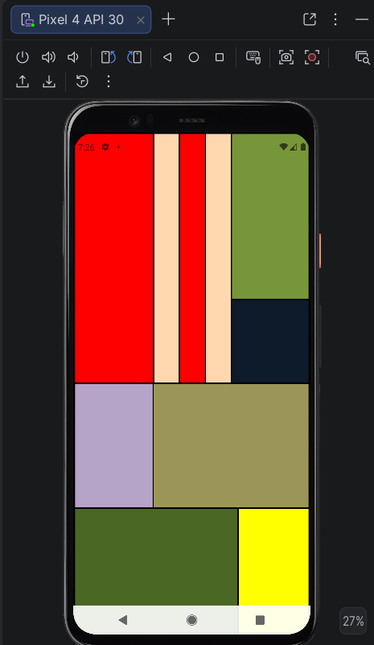
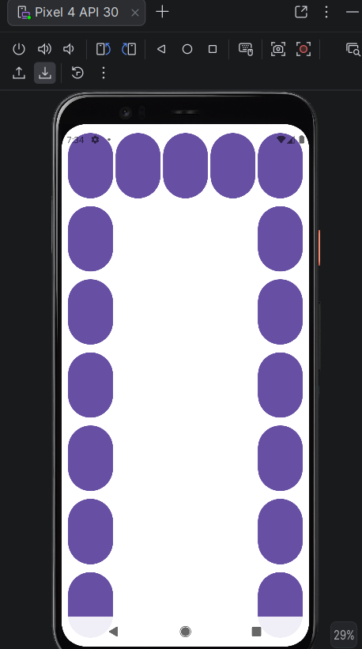

# Mob-app-PR-2

# Отчет

## Практическая работа №2

## Основы XML-разметки. Менеджеры размещения LinearLayout и GridLayout

**Выполнил:** Скирневский Денис Сергеевич  
**Курс:** 2  
**Группа:** 2  
**Направление:** ИНС Информационные системы и технологии

---

### Цель работы

Цель работы: Изучить основы языка разметки XML для описания пользовательского интерфейса Android-приложений. Научиться использовать менеджеры размещения (контейнеры) LinearLayout и GridLayout для создания сложных экранов. Освоить основные атрибуты View и создание простых Drawable-ресурсов.

### Ход работы
В процессе выполнения практической работы был создан Android-проект, в котором интерфейс приложения был реализован с помощью XML-разметки.

Сначала были рассмотрены основные принципы построения XML-файлов в Android. Было изучено, что XML-разметка позволяет описывать внешний вид экрана отдельно от программной логики приложения.

Далее были изучены основные атрибуты элементов интерфейса:

layout_width, layout_height, padding, layout_margin, gravity, layout_gravity, background, text, src и другие.

После этого в папке res/drawable были созданы графические ресурсы:

rectangle.xml;
circle.xml.

Эти ресурсы использовались для отображения простых фигур на экране приложения.

Затем был реализован экран с использованием контейнера LinearLayout. С его помощью элементы были расположены сначала вертикально, а затем горизонтально. Также были рассмотрены параметры выравнивания элементов внутри контейнера.

В самостоятельной части практической работы были выполнены следующие задания:

Выполнена композиция по варианту с использованием менеджеров размещения.
Реализована буква П из кнопок с помощью GridLayout.

После работы с LinearLayout был изучен контейнер GridLayout, который позволяет размещать элементы в виде таблицы. С помощью GridLayout была создана сетка из кнопок, а также рассмотрено объединение ячеек с помощью атрибутов layout_columnSpan и layout_rowSpan.

  
  
<i>Рисунок 1. Композиция с использованием вложенных LinearLayout</i>

  
  
<i>Рисунок 2. Буква П из кнопок</i>

### Вывод
В результате выполнения практической работы были изучены основы XML-разметки в Android.

Я научился создавать пользовательский интерфейс с помощью контейнеров LinearLayout и GridLayout, задавать размеры и отступы элементов, управлять их расположением на экране, а также использовать атрибуты gravity, layout_gravity, background и layout_weight.
### Ответы на контрольные вопросы

1. **Вопрос 1:** XML — это язык разметки, который используется для описания структуры данных. В Android XML применяется для создания интерфейсов приложения, описания экранов, ресурсов, цветов, строк и стилей.

2. **Вопрос 2:** Тег — это элемент XML-документа. Он состоит из имени элемента и атрибутов. Тег может быть парным, например <TextView></TextView>, или одиночным, например <Button />.

3. **Вопрос 3:** Основные менеджеры размещения: LinearLayout, GridLayout, ConstraintLayout, RelativeLayout, FrameLayout, TableLayout. LinearLayout размещает элементы по вертикали или горизонтали. GridLayout располагает элементы в виде сетки. ConstraintLayout позволяет задавать связи между элементами. FrameLayout размещает элементы слоями. TableLayout используется для табличного размещения.

4. **Вопрос 4:** LinearLayout размещает элементы в одну линию — вертикально или горизонтально. GridLayout размещает элементы в виде таблицы со строками и столбцами. LinearLayout удобен для простых последовательных блоков, а GridLayout — для сеток, таблиц, кнопок и построения фигур из элементов.

5. **Вопрос 5:** match_parent означает, что элемент занимает всё доступное пространство родительского контейнера. Например, android:layout_width="match_parent". wrap_content означает, что размер элемента зависит от его содержимого. Например, кнопка с android:layout_width="wrap_content" будет подстраиваться под текст.

6. **Вопрос 6:** android:gravity выравнивает содержимое внутри элемента, например текст внутри кнопки. android:layout_gravity выравнивает сам элемент внутри родительского контейнера.

7. **Вопрос 7:** В Android используются единицы измерения px, dp и sp. dp применяется для размеров элементов и отступов, так как учитывает плотность экрана. sp используется для размера текста, так как учитывает настройки масштаба шрифта пользователя.

8. **Вопрос 8:** Чтобы создать простую фигуру, нужно в папке res/drawable создать XML-файл с тегом <shape>. Для прямоугольника используется android:shape="rectangle", для круга — android:shape="oval". Цвет задаётся через <solid>, обводка через <stroke>, а скругление углов через <corners>.
